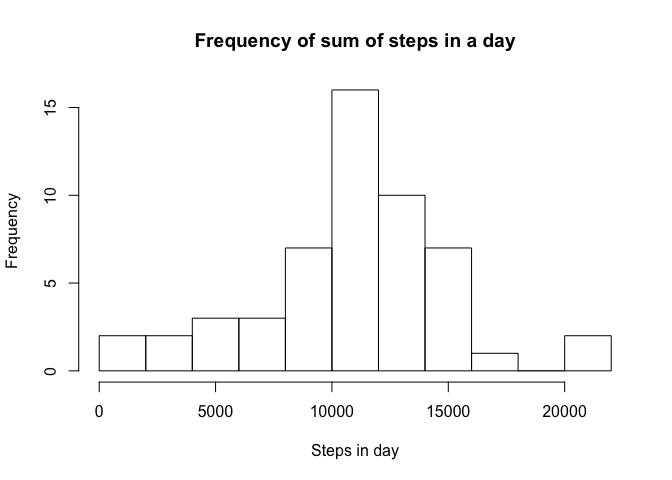
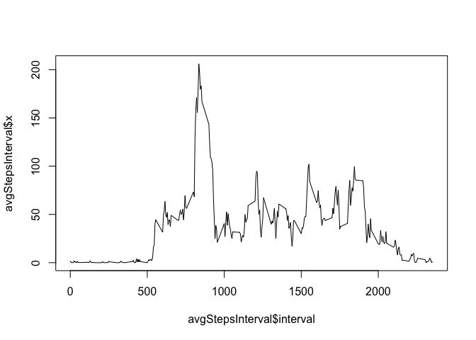
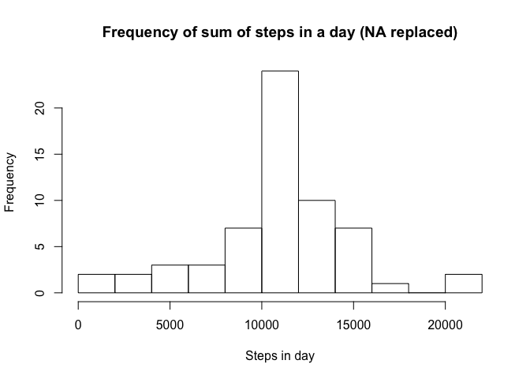
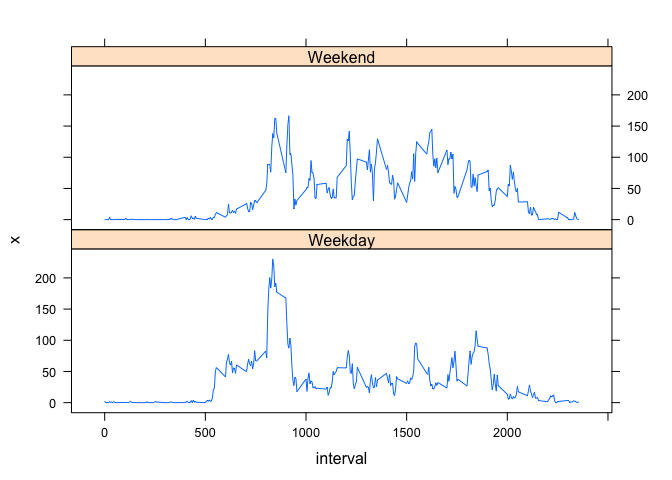

# Reproducible Research: Peer Assessment 1


## Loading and preprocessing the data


```r
library(chron)
library(lattice)
activity = read.csv("./activity.csv")
```

## What is mean total number of steps taken per day?

This code creates a table with sums of steps per day.  Then a histogram is created using the base plotting system.


```r
sumStepsDay = aggregate(activity$steps, 
                        by=list(date=activity$date), 
                        FUN = sum)

hist(sumStepsDay$x, 
     breaks = 10, 
     main = "Frequency of sum of steps in a day", 
     xlab = "Steps in day")
```

 

Calculate the mean and median total steps taken each day.


```r
mean(sumStepsDay$x, na.rm = T)
```

```
## [1] 10766.19
```

```r
median(sumStepsDay$x, na.rm = T)
```

```
## [1] 10765
```

## What is the average daily activity pattern?

Averages the steps taken each day by interval, and plot the time series.

```r
avgStepsInterval = aggregate(activity$steps, 
                             by=list(interval=activity$interval), 
                             FUN = mean, 
                             na.rm = T)

plot(avgStepsInterval$interval, avgStepsInterval$x, type = "l")
```

 

Return the interval with the highest average steps across all days.

```r
sorted = avgStepsInterval[with(avgStepsInterval, order(-x)),]
sorted[1,1]
```

```
## [1] 835
```

## Imputing missing values

Report the number of NA observations in dataframe

```r
sum(is.na(activity))
```

```
## [1] 2304
```

Create a loop to replace NA values with average steps for all days on that interval.  New dataset with NA values replaced is `naReplaced`.


```r
# function to replace NA steps values in activity with avg steps 
# in time interval
replaceNa = function(df1, df2) {
    for(i in 1:nrow(df1)) {
        if(is.na(df1[i,1])) {
            interval = df1[i, 3]
            row = which(df2$interval == interval)
            df1[i, 1] = as.integer(df2[row, 2])
        }
    }
    df1
}

naReplaced = replaceNa(activity, avgStepsInterval)
```

Histogram using the `naReplaced` dataset.  The new histogram shows higher frequencies of steps reported.


```r
sumStepsDay2 = aggregate(naReplaced$steps, 
                        by=list(date=naReplaced$date), 
                        FUN = sum)

hist(sumStepsDay2$x, 
     breaks = 10, 
     main = "Frequency of sum of steps in a day (NA replaced)", 
     xlab = "Steps in day")
```

 

Mean and median of the sum of steps per day with missing values replaced.


```r
mean(sumStepsDay2$x)
```

```
## [1] 10749.77
```

```r
median(sumStepsDay2$x)
```

```
## [1] 10641
```

## Are there differences in activity patterns between weekdays and weekends?

Adding factor variables for weekend on the `naReplaced` data.  The factor has two levels: Weekend, Weekday.


```r
naReplaced$asDate = as.Date(naReplaced$date)
naReplaced$weekend = chron::is.weekend(naReplaced$asDate)
naReplaced$weekend[naReplaced$weekend == "TRUE"] = "Weekend"
naReplaced$weekend[naReplaced$weekend == "FALSE"] = "Weekday"
naReplaced$weekend = factor(naReplaced$weekend)
```

Calculate the mean of steps taken by interval and weekend.  Then use lattice plot to panel plot of average steps by interval, by weekday and weekend.


```r
naReplacedInterval = aggregate(naReplaced$steps, 
                             by=list(interval=naReplaced$interval, 
                                     weekend=naReplaced$weekend), 
                             FUN = mean)

xyplot(x ~ interval | weekend, 
       data = naReplacedInterval, 
       layout = c(1,2), 
       type = "l")
```

 
